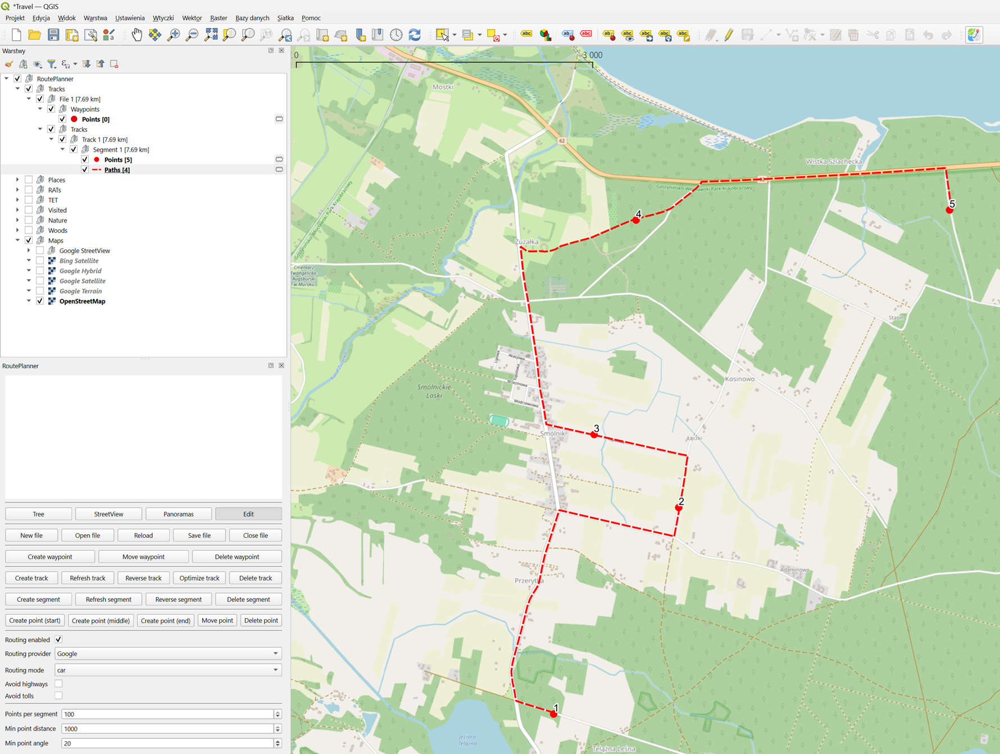

# QGIS Route Planner

A lightweight QGIS plugin for planning and managing routes inside QGIS.



## Supported path-finding APIs

- Google Directions API — Commercial routing service (API key required).
- GraphHopper — Routing and optimization via HTTP API.
- Mapbox Directions API — Commercial directions API (requires access token).

## Supported tile and image providers

- Bing
- Google Maps
- Mapbox
- OpenStreetMap
- Google Street View

## Installation

- Unpack into your QGIS plugins directory.
   - on Linux `~/.local/share/QGIS/QGIS4/profiles/default/python/plugins/`
   - on Windows `%APPDATA%\QGIS\QGIS$\profiles\default\python\plugins/`

### Python dependencies

- This plugin requires the third-party packages `googlemaps`, `gpxpy` and `requests`. From OSGeo4W Shell or an elevated
command prompt run:

  ```cmd
  "C:\\Program Files\\QGIS 4.x\\bin\\python.exe" -m ensurepip --upgrade
  "C:\\Program Files\\QGIS 4.x\\bin\\python.exe" -m pip install --upgrade pip
  "C:\\Program Files\\QGIS 4.x\\bin\\python.exe" -m pip install googlemaps==4.10.0 gpxpy==1.5.0 requests==2.34.2
  ```

- Restart QGIS.

## Configuration

- Copy `config.py.example` into `config.py` and edit it to add your API keys.
- Then, enable the plugin in QGIS via `Plugins > Manage and Install Plugins...`.
- Click on the `Route Planner` icon in the toolbar to open the plugin.
- Click on `Tree` button to load configuration. The plugin will create `RoutePlanner` folder in layer tree.

## Usage

### Create or load GPX

Click `New file` or `Open file` to create or load a GPX file. The file will be created as group in the layer tree. Each
GPX track and segment has its own group in the layer tree.  Each segment is represented by two layers. One with control
points and second with path. The control points layer is editable, while the path layer is read-only.

#### Edit route

There two ways to edit the route:

- Click on `Edit` button to enable `Edit Mode`. When editing is enabled, the following actions are available:
  - Click and drag control point to a new position. 
  - Click on path between two control points to create a new control point at the selected position.
- Managing each point individually:
  - `Create point (start)` — Left click anywhere on the map creates a new control point at the start of the route.
  - `Create point (middle)` — Left click on path between two points creates a new control point at the selected position.
  - `Create point (end)` — Left anywhere on the map creates a new control point at the end of the route.
  - `Move point` — Left click and drag a control point to move it to a new position.
  - `Delete point` — Left click on a control point to delete it.

### Edit options

There are several options available for controling how route is generated:

- `Routing enabled` — Select to use routing API for path-finding. Otherwise, the plugin will create straight line
between control points.
- `Routing provider` — Select routing API to use for path-finding.
- `Routing mode` — Select routing profile to use for path-finding (car, bicycle or walk).
- `Avoid highways` — Select to avoid highways when routing.
- `Avoid tolls` — Select to avoid toll roads when routing.

### Save route

To save the created GPX file, click `Save` button in the plugin dialog. The plugin will save the GPX file to the
selected location.

### Street View

Click on `Street View` button and then left click on the map, to open Street View preview in the plugin dialog.

## Limitations

All layers created by this plugin are temporary layers. They will be removed when the project is closed, so remember to
save your GPX file before closing the project.
